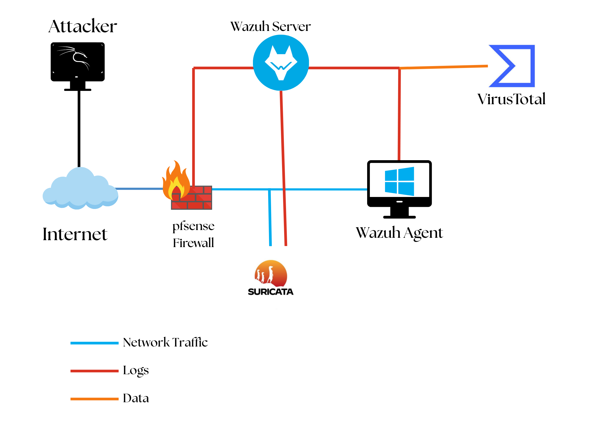

# 🛡️ Enterprise SOC Intelligence Lab (Wazuh/pfSense/Suricata)

> _End-to-End deployment of a hyper-integrated Detection & Response architecture._

## ⚡ What is this?

A fully weaponized, virtualized Security Operations Center (SOC) environment built to simulate, detect, and neutralize advanced persistent threats. This lab integrates an open-source XDR (Wazuh) with network-level deep packet inspection (Suricata) and firewalling (pfSense) to create a comprehensive perimeter of absolute visibility.

**Why?** Because reading about security isn't enough. You have to build the panopticon to understand how to break it (or defend it).

## 🏗 Architecture Blueprint

The environment operates entirely within isolated VMware infrastructure to emulate an enterprise corporate network under active simulation.

1. **Wazuh Central Hub:** The brain. Manages the Indexer, Server, and Dashboard. Ingests and correlates all endpoint and network telemetry.
2. **Windows 11 Client:** The sacrificial endpoint. Instrumented with Wazuh Agent and Sysmon for ring-0 telemetry.
3. **Kali Linux:** The aggressor. Dedicated attack infrastructure used to fire exploits and brute-force campaigns into the perimeter.
4. **pfSense Edge Firewall:** The gatekeeper. Controls ingress/egress and forwards structural traffic anomalies directly into Wazuh.
5. **Suricata IDS/IPS:** The wire-tap. Passively monitors deep packet traffic and fires high-fidelity signatures to the centralized SIEM.

## 📡 Operational Capabilities

This SOC implementation isn't just a logging sink; it actively leverages multiple threat intelligence streams to formulate a layered defense.

### 1. File Integrity & Reputation (VirusTotal)

- Integrates the VirusTotal API directly into the Wazuh Manager to automatically scan suspected binaries dropped on the Windows endpoint.
- FIM (File Integrity Monitoring) watches critical OS directories and triggers alerts the exact millisecond a file is mutated.

### 2. Deep Windows Telemetry (Sysmon)

- Basic Windows Event Logs aren't enough. Sysmon is deployed to track exact process creation trees, network connections spawned by executables, and file creation hashes.
- Sysmon logs are pipelined directly into Wazuh for centralized behavioral analysis.

### 3. Attack Simulation: SSH Brute Force Campaign

- Simulated sustained Hydra-based brute-force attacks from the Kali aggressor node against the internal infrastructure.
- Validated real-time alert generation via `Event ID 4625` (Failed Logon) and Wazuh native correlation engines.
- Actively defended using Active Response automation to outright ban the attacking IPs from the network layer.

## 📖 Deep-Dive Documentation

Every single phase of this infrastructure has been meticulously documented. If you want to replicate this setup, the operational manuals are included here:

- [Wazuh Core Configuration](docs/Wazuh_configuration.pdf)
- [Suricata IDS Integration](docs/Suricata_integration.pdf)
- [pfSense Edge Configuration](docs/Pfsense_integration.pdf)
- [VirusTotal API Enrichment](docs/VirusTotal_integration.pdf)
- [FIM (File Integrity Monitoring)](docs/File_integrity_monitoring.pdf)
- [Sysmon & Telemetry Pipeline](docs/Logs&Sysmon_ingestion.pdf)
- [Active Threat: Brute Force Simulation](docs/SSH_Brute_Force.pdf)

> **[Download the Master Compilation PDF](docs/Soc_Home_LAB.pdf)**

## ⚠️ Engagement Rules

This environment is a controlled detonation chamber. Ensure all attack simulations map explicitly to authorized infrastructure.

---

_Built to detect. Engineered to secure._
