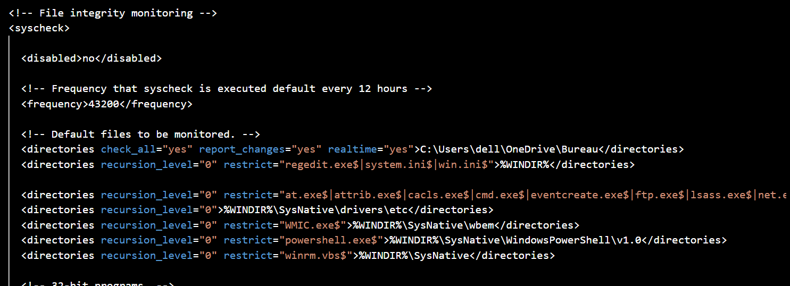

File Integrity Monitoring in Wazuh

1 Introduction

Attackers don’t always just break into systems — they change them. For ex- ample, ransomware encrypts files, attackers modify logs, and other malicious actions alter system data. Detecting these changes quickly is critical. File Integrity Monitoring (FIM)  is a security practice that tracks file and directory modifications in real time and generates alerts when suspicious activity is detected. FIM is also a key requirement for many regulatory compliance standards, including  PCI-DSS, HIPAA, and ISO 27001 . This guide demonstrates how to configure  Wazuh’s FIM feature  on a Windows endpoint. It assumes Wazuh is already installed and that the Wazuh agent is deployed on the target machine.

2 Configuring Wazuh FIM on Windows

This guide assumes that Wazuh is already installed and the agent is deployed on a Windows machine. To monitor specific files or folders with Wazuh’s FIM feature:

1. Open the Wazuh agent configuration file on the endpoint:

/var/ossec/etc/ossec.conf

2. Within the  <syscheck>  block, add the directory you want to monitor. Example: monitoring a folder on the Windows desktop.

<directories check_all="yes" report_changes="yes" realtime="yes">

C:\Users\dell\OneDrive\Bureau </directories>

3. (Optional) Control subdirectory monitoring with the  recursion level  at- tribute:

•  0 – monitor only the specified folder

•  1 – monitor the folder and immediate subfolders

•  2 – monitor the folder and all nested subfolders up to two levels deep

4. Save the file and restart the Wazuh agent:

sudo systemctl restart wazuh-agent

3 Validation: Monitoring in Action

After configuration, Wazuh will begin tracking file activity in the specified path. As shown in Figure 1 and Figure 2, the test file  file.docx  was:

•  Modified several times

Each of these actions was detected and reported by Wazuh, triggering alerts with appropriate rule levels.

Figure 1: Configuration to monitor Desktop folder in ossec.conf

Figure 2: Wazuh alerts showing file creation, modification, and deletion

