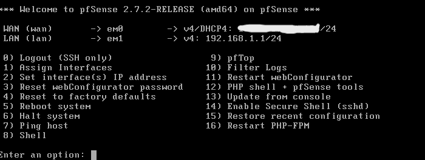
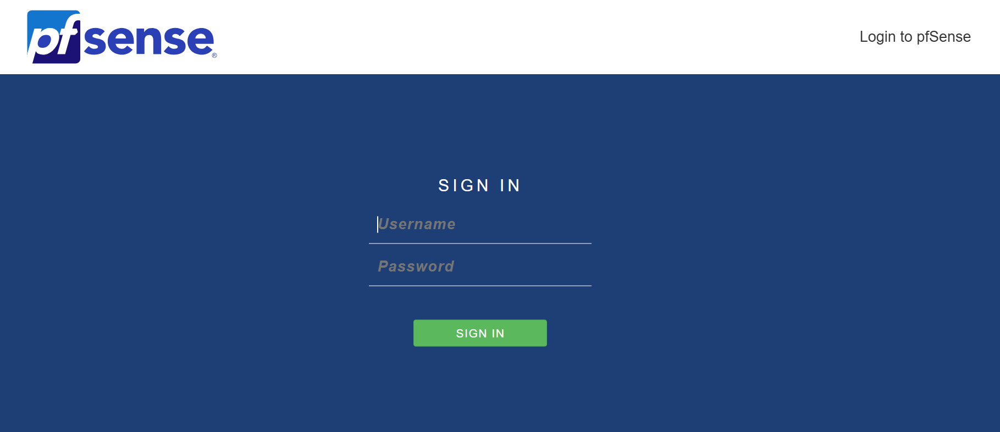

Integrating PfSense with Wazuh SIEM

Introduction

A  firewall  is a critical security solution that inspects and controls incoming and outgoing traffic on a network or device. Think of it like a  security guard at the entrance of a building : it decides who can enter and who must stay out, based on predefined rules. In modern environments, firewalls help:

•  Prevent unauthorized access

•  Block malicious traffic

•  Segment networks for better security

There are different types of firewalls:  packet-filtering, stateful inspec- tion, proxy-based, and next-generation firewalls (NGFWs) , each providing increasing levels of inspection and control. In this guide, we build a  hands-on SOC lab  using:

•  pfSense  → an open-source firewall and router.

•  Wazuh  → an open-source SIEM for log analysis, alerting, and threat detection.

By integrating pfSense logs into Wazuh, we simulate  real-world SOC operations , monitoring both network and endpoint events.

1 Step 1: Requirements

Before starting, ensure you have the following:

1.  Virtual Machine Software  → VMware Workstation Pro (used in this guide, but VirtualBox also works).

2.  pfSense ISO  → Download the latest version from the official pfSense website.

3.  Wazuh Manager  → Running and accessible in your lab environment.

2 Step 2: Creating a Virtual Machine for pf- Sense

2.1 Open VMware

Navigate to  File ¿ New Virtual Machine .

2.2 Select the Installation Media

Choose  Installer disc image file (ISO)  and browse for the downloaded pfSense ISO.

2.3 Name Your VM

Use a descriptive name such as  pfSense  and pick a save location.

2.4 Allocate Disk Space

•  20 GB minimum  (store as a single file recommended).

2.5 Customize Hardware

•  RAM : 1 GB minimum (2 GB recommended).

•  CPU : 1 vCPU (2 cores recommended).

•  Network Adapters :

– Adapter 1 (WAN)  → NAT (simulates internet access).

– Adapter 2 (LAN)  → Host-only (isolated internal lab network).

2.6 Assign Interfaces

•  WAN (em0)  → Configured via DHCP (IP in 192.x.x.x/24 range).

•  LAN (em1)  → Static IP 192.168.1.1/24.

Figure 1: pfSense interface

3 Step 3: Accessing the pfSense Web Inter- face

1. Open a browser from a VM (e.g., Kali Linux) connected to the LAN network.

2. Go to: https://192.168.1.1/

3. Log in with default credentials:

•  Username:  admin

•  Password:  pfsense

Important:  Change the default credentials immediately after login.

Figure 2: pfSense web interface login

Figure 3: pfSense dashboard

4 Step 4: Why Combine pfSense with Wazuh?

•  pfSense  acts as the  network security gateway , generating logs on traffic, connections, and blocked events.

•  Wazuh  functions as the  Security Information and Event Man- agement (SIEM)  platform, collecting and analyzing logs to detect suspicious activity.

Together, they form a  mini SOC environment , where firewall events are monitored and correlated with endpoint activity.

5 Step 5: Configuring pfSense Logs in Wazuh

5.1 Enable Remote Logging in pfSense

•  Go to  Status  → System Logs  → Settings .

•  Check  Enable Remote Logging .

•  Add your  Wazuh server’s IP  (e.g., 192.168.200.50) under  Remote Syslog Servers .

•  Set  Port  to 514 (default syslog).

•  Select log categories to forward: System, Firewall, VPN, DHCP, DNS.

Figure 4: pfSense remote logging configuration

5.2 Configure Wazuh Syslog Input

On the Wazuh Manager, edit  /var/ossec/etc/ossec.cfg :

<ossec_config >

<! -- pfSense syslog input -- > <remote >

<connection >syslog </connection > <port >514</port > <protocol >udp</protocol > <allowed -ips>YOUR_PF_SENSE_IP </allowed -ips> <local_ip >YOUR_WAZUH_SERVER_IP </local_ip > </remote > </ ossec_config >

Restart Wazuh after changes.

6 Step 6: Creating a Custom Decoder and Rules for pfSense Logs

Since pfSense logs have a unique format, Wazuh may not parse them correctly out of the box.

6.1 Custom Decoder

A  decoder  extracts key fields (source IP, destination IP, protocol). Example ( pfsense-custom-decoder.xml ):

<decoder name =" pfsense -custom"> <prematch >filterlog </ prematch > </decoder >

<decoder name =" pfsense -fields"> <parent >pfsense -custom </parent > <regex >(\w+)\d+:\S*,\S*,\S*,(\S+) ,\S*,\S*,(\S+) ,\S*,\S*,\S

*,\S*,\S*,\S*,\S*,\S*,\S*,\S*,(\S+) ,\S*,(\S+) ,(\S+) ,(\d +);(\d+) ,\S*</regex > <order >logsource ,id ,section ,protocol ,srcip ,dstip ,srcport ,

dstport </order > </decoder >

6.2 Custom Rules

A  rule  assigns severity levels and alerts based on matched events. Example ( pfsense-custom-rules.xml ):

<group name="pfsense ,firewall ,">

<! -- Generic pfSense log -- > <rule id="100111" level="3">

<decoded_as >pfsense -custom </decoded_as > <description >pfSense log received </description > </rule >

<! -- Successful login -- > <rule id="100112" level="3">

<if_sid >100111 </if_sid > <match >Successful login </match > <description >pfSense: Successful login from  $ ( srcip)</ description > </rule >

<! -- Allowed traffic -- > <rule id="100113" level="5">

<if_sid >100111 </if_sid > <match >pass </match > <description >pfSense: Allowed traffic from  $ ( srcip) to  $ ( dstip)</description > </rule >

<! -- Blocked traffic -- > <rule id="100114" level="7">

<if_sid >100111 </if_sid > <match >block </match > <description >pfSense: Blocked traffic from  $ ( srcip) to  $ ( dstip)</description > </rule >

<! -- Authentication error -- > <rule id="100115" level="10">

<if_sid >100111 </if_sid > <match >authentication error </match > <description >pfSense: Authentication error for user  $ ( dstuser) from  $ ( srcip)</description > </rule >

•  Level 3 (Informational):  Successful logins.

•  Level 5 (Normal alert):  Allowed traffic.

•  Level 7 (Warning):  Blocked traffic.

•  Level 10 (High):  Authentication errors.

By combining  pfSense  and  Wazuh , you now have a  practical SOC lab that:

•  Monitors and analyzes firewall traffic (allowed vs. blocked).

•  Centralizes logs for correlation and alerting.

•  Detects authentication attempts and suspicious behavior.

•  Provides a foundation for hands-on practice in SOC operations.

This setup is ideal for  cybersecurity students, SOC analysts in training, or homelab enthusiasts  who want to explore  network security monitoring  in a safe environment.

