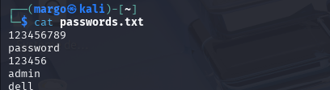
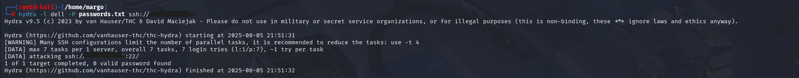

Brute Force Attack: Simulation, Detection, and Defense

1 Introduction

A  brute force attack  is a method where an attacker tries multiple password or key combinations repeatedly until the correct one is found. It is one of the simplest yet most common attack techniques used to gain unauthorized access to systems, applications, or accounts. Disclaimer:  The following content is for  educational and ethical purposes only . These techniques should only be executed in a  controlled lab environment  with explicit permission. Unauthorized use against systems you do not own or manage is illegal and punishable by law.

2 Types of Brute Force Attacks

•  Simple brute force attack  – Directly attempting all possible combinations of passwords.

•  Dictionary attack  – Using a predefined list of likely passwords (a “dictionary”) instead of trying every possible combination.

•  Hybrid brute force attack  – Combining dictionary attacks with variations (e.g., adding numbers or symbols).

•  Reverse brute force attack  – Starting with a single commonly used password and trying it against many usernames.

•  Credential stuffing  – Using leaked username-password pairs from previous data breaches to attempt logins on other systems.

3 Popular Brute Force Tools

•  John the Ripper  – A fast password cracker for Unix, Windows, and other platforms.

•  Hashcat  – A powerful GPU-based password recovery tool, ideal for cracking password hashes.

•  Aircrack-ng  – Focused on cracking Wi-Fi network keys.

•  L0phtCrack  – Used to audit and recover Windows passwords.

4 Hydra for Brute Force Attacks

Hydra  is one of the most widely used tools for network login brute forcing. It can perform rapid dictionary-based attacks against more than 50 protocols, including  HTTP, SSH, FTP, RDP, Telnet , and more.

4.1 Hydra Command Structure

hydra -L <username_file > -P <password_file > <target >

•  -L  : Specifies the file containing a list of usernames.

•  -P  : Specifies the file containing a list of passwords.

5 Brute Force SSH

A brute force SSH attack attempts to gain unauthorized access to a remote machine by repeatedly trying different username and password combinations against the  SSH service (port 22 by default) .

5.1 Example Hydra Command

hydra -L <username_file > -P <password_file > ssh://< target_ip >

6 System Requirements

•  Attacker Machine : Kali Linux

•  Target Machine : Windows system (with SSH enabled)

Note:  Since Windows does not enable SSH by default, you must install and enable OpenSSH Server before running this test.

7 Simulating an SSH Brute Force Attack with Hydra

7.1 Step 1: Preparing the Password List

On the  attacker machine (Kali Linux) , we first create a list of possible passwords in a file named  passwords.txt . This file will be used by Hydra to attempt login combinations against the target system.

Figure 1: Password file used for brute force simulation

7.2 Step 2: Running the Hydra Command

Since we already know the username of the target system is  dell , we use the  -l  option to specify it directly. If we did not know the username, we could use the  -L  option along with a file containing a list of usernames.

hydra -l dell -P passwords.txt ssh://< target_ip >

Figure 2: Running Hydra against SSH service

7.3 Step 3: Observing the Attack

Hydra will automatically attempt multiple login attempts using the given username and password list. Each failed login attempt is logged by the target’s SSH service.

8 Detection in Wazuh

After simulating the brute force attack, we switch to the  Wazuh dashboard . In the Threat Hunting  section, we can see the following indicators:

• Multiple  failed login attempts  for the SSH service.

• Alerts triggered by  Wazuh security rules  detecting brute force activity.

•  Event details, such as the source IP (attacker machine) and the affected service (SSH).

Figure 3: Wazuh detecting brute force attack

Windows Security Event Analysis

Event Details

Field name Field value Meaning

data.win.eventdata.failureReason  %%2313 Unknown user name or bad pass- word.

data.win.eventdata.keyLength 0 No encryption key was used.

data.win.eventdata.logonProcessName Advapi Typical for services, not interactive logins.

data.win.eventdata.logonType 8 Logon type 8 = NetworkCleartext. Credentials were sent in clear text over the network (common with SSHD).

data.win.eventdata.processId 0x65d8 The process ID (0x65d8) of the pro- cess that attempted the logon.

Confirms someone tried to connect to this machine over SSH.

data.win.eventdata.processName C:\Windows\ System32\OpenSSH\ sshd.exe

data.win.eventdata.status 0xc000006d Status = Logon failure.

data.win.eventdata.subStatus 0xc0000064 User logon with unknown user name OR bad password.

data.win.system.channel Security The event comes from the Windows Security log.

data.win.system.eventID 4625 Event ID 4625 = An account failed to log on.

data.win.system.eventRecordID 919137 A unique sequential ID for this event in the event log.

data.win.system.systemTime 2025-08- 05T20:51:34.3997254Z

Event timestamp (UTC).

decoder.name windows_eventchannel  Wazuh parsed this as a Windows EventChannel log.

input.type log Confirms this came from a log source (Windows logs).

rule.firedtimes 14 At least 14 failed logins of this type have occurred.

Table 1: Windows Event 4625 – Failed Logon Attempt

•  On  05-08-2025 at 20:51:34 UTC , the Windows machine  MyPc  received an SSH login attempt via  sshd.exe .

•  Authentication failed with error  Unknown username or bad password  ( 0xc0000064 ).

• This was logged as  Event ID 4625  (failed logon).

•  Wazuh classified it under  failed authentication events , severity level  5 , and mapped it to multiple compliance frameworks.

• The rule has already fired  14 times , so this is  not an isolated event .

9 Defensive Countermeasures

While detection is critical,  prevention  strengthens system defenses against brute force attempts. Recommended strategies include:

• Use strong and unique passwords.

• Enable multi-factor authentication (MFA).

• Regularly monitor login activity.

•  Implement rate-limiting to restrict login attempts and lock accounts after repeated failures.

10 Conclusion

Brute force attacks remain one of the most common methods used by attackers to gain unauthorized access to systems and services. In this report, we demonstrated how such an attack can be simulated using the Hydra tool against an SSH service. We also observed how Wazuh is capable of detecting these attacks in real time, highlighting multiple failed login attempts in the dashboard. This exercise shows the importance of monitoring and detection tools like Wazuh in strengthening system defenses. While brute force attacks are relatively simple, they can still be effective if strong passwords and proper security measures are not in place. In future work, deeper analysis of Wazuh logs and alerting mechanisms will provide further insights into identifying, investigating, and mitigating brute force threats.

