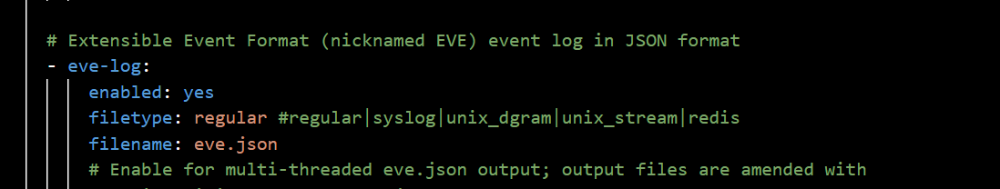
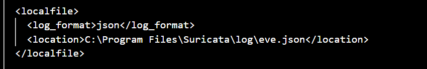

Integrating Suricata with Wazuh

Integrating Suricata with Wazuh

Introduction

Intrusion Detection Systems (IDS) and Intrusion Prevention Systems (IPS) are essential components in a layered cybersecurity strategy. These systems inspect network traffic for known and unknown threats to help detect and mitigate attacks.

1 IDS vs. IPS Overview

•  IDS (Intrusion Detection System):

–  Detects threats by inspecting traffic using:

∗ Signatures (rules) ∗ IoCs (hashes, domains, URLs, TLS/SSH fingerprints) ∗ Lua scripting

–  Generates alerts and logs but does not block traffic.

•  IPS (Intrusion Prevention System):

–  Takes proactive action by dropping or allowing traffic based on in- spection results.

2 About Suricata

Suricata is an open-source network threat detection engine capable of function- ing as both an IDS and an IPS. It is widely used in enterprise and government environments.

•  By default, Suricata runs in IDS mode and logs suspicious traffic.

•  In IPS mode, it can block malicious packets in real time.

3 Setting Up Suricata on Windows

3.1 Download and Install

1. Visit:  https://suricata.io/download/

2. Download the Windows installer (.msi)

3. Run the installer with default settings

Suricata installs to:

C:\Program Files\Suricata\

Contents include:

•  suricata.exe  – the main executable

•  suricata.yaml  – configuration file

•  rules \  – rule files directory

•  log \  – log output folder

3.2 Install and Verify Npcap

Suricata requires Npcap to capture network traffic. Step 1:  Download from  https://npcap.com/#download During installation:

•  Enable WinPcap API-compatible mode

•  Enable startup at boot

Step 2:  Verify that Npcap is running:

Get-Service -Name npcap

Expected output:

Status Name DisplayName ------ ---- ----------- Running npcap Npcap Packet Driver (NPCAP)

If not running:

Start-Service -Name npcap

4 Configure Suricata

Open Configuration

C:\Program Files\Suricata\suricata.yaml

Define Network Interface

To view interfaces:

Get-NetAdapter | Select Name, Status

Example config snippet:

- interface: Ethernet

Add Rule Files

In  suricata.yaml , locate and update:

rule-files:

- local.rules - emerging-all.rules

Make sure  emerging-all.rules  exists in the  rules \  folder.

Enable JSON Logging

Enable EVE JSON output:

enabled: yes filetype: regular filename: eve.json

Figure 1: Figure 1: JSON logging configuration in suricata.yaml

5 Running Suricata

In PowerShell (Admin):

cd "C:\Program Files\Suricata\" suricata -c suricata.yaml -i <interface>

Replace  <interface>  with your adapter name.

Suricata Log Files

C:\Program Files\Suricata\log\

Important files:

•  eve.json  – JSON alerts

•  fast.log  – quick alerts

•  stats.log  – system stats

6 Integrating with Wazuh SIEM

Step 1: Confirm EVE JSON Output

Ensure Suricata is writing logs to:

C:\Program Files\Suricata\log\eve.json

Step 2: Configure Wazuh Agent

C:\Program Files (x86)\ossec-agent\ossec.conf

<localfile>

<log_format>json</log_format> <location>C:\Program Files\Suricata\log\eve.json</location> </localfile>

Figure 2: Figure 2: Wazuh Agent config for EVE JSON

Step 3: Restart the Wazuh Agent

Restart-Service -Name wazuh

Step 4: Generate Alerts

Use test traffic such as:

ping google.com

Step 5: View Alerts in Wazuh

1. Open Wazuh Dashboard

2. Navigate to  Threat Hunting

3. Filter by  Suricata

Figure 3: Figure 3: Suricata alert in Wazuh dashboard

7 Conclusion

Suricata is a powerful, flexible IDS/IPS that integrates easily with Wazuh for centralized visibility and alerting. With the proper configuration, your Windows environment gains advanced network monitoring capabilities with open-source tools.

