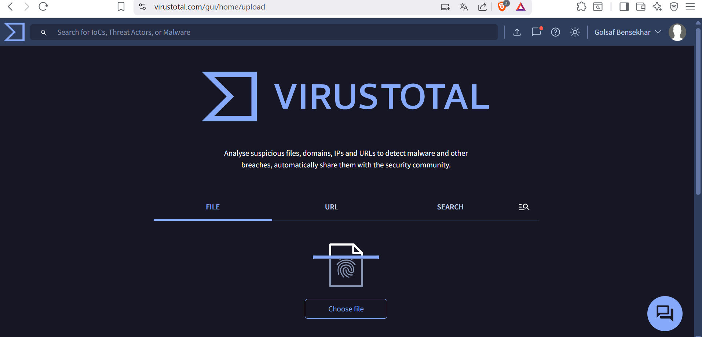
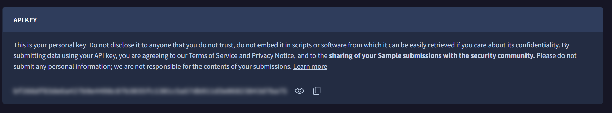

Integrating VirusTotal with Wazuh SIEM for Threat Intelligence

Prerequisites

Before starting, ensure you have the following:

1. A running  Wazuh SIEM  setup

2. At least one  Wazuh agent  connected to the Wazuh manager

3. A valid  VirusTotal API key

Introduction

In a modern Security Operations Center (SOC), analysts face hundreds of alerts daily. Without proper context, it can be difficult to distinguish between false positives and real threats. This is where  threat intelligence  becomes essential, it enriches raw alerts with external data, helping analysts prioritize incidents more effectively. VirusTotal  is a widely used threat intelligence platform that analyzes files, URLs, domains, and IPs against multiple antivirus engines. By inte- grating VirusTotal with Wazuh, you can automatically enrich alerts with reputation data, making investigations faster and more accurate. Note:  Any file or URL uploaded to VirusTotal should be considered public. Do not upload sensitive or proprietary files, as they may be accessible to other organizations.

Understanding VirusTotal

VirusTotal allows security professionals to:

•  Upload and scan files or URLs  using dozens of antivirus engines

•  Retrieve file and URL hashes  for malware tracking

•  Extract metadata  to aid in investigations

•  Leverage the VirusTotal API  to automate lookups and integrate with SIEM platforms like Wazuh

This integration enables Wazuh to automatically query VirusTotal when new files are detected on endpoints, enriching alerts with reputation scores.

Step 1: Obtain a VirusTotal API Key

1. Create an account on VirusTotal.

2. Navigate to  Profile  → API Key .

3. Copy your personal API key for later use.

Step 2: Configure Wazuh Manager

On your  Wazuh Manager , edit the main configuration file:

Open C:\ Program Files (x86)\ossec -agent\ossec.conf with a text editor (e.g., Notepad) and add the configuration snippet.

Insert the following block (replace  YOUR API KEY  with your actual key):

<integration >

<name >virustotal </name > <api_key >YOUR_API_KEY </api_key > <alert_format >json </alert_format > </integration >

Save the file, then restart the Wazuh Manager:

net stop wazuhsvc net start wazuhsvc

Step 3: Configure the Wazuh Agent

On the  Wazuh Agent , define which directory should be monitored in real- time. Edit the configuration file:

Open C:\ Program Files (x86)\ossec -agent\ossec.conf with a text editor (e.g., Notepad) and add the configuration snippet.

Add the following snippet:

<syscheck >

<directories realtime="yes">/home/virustotaltest </ directories > </syscheck >

This ensures that any file added to  /home/virustotaltest  will trigger a VirusTotal lookup. Restart the agent to apply changes:

net stop wazuhsvc net start wazuhsvc

By integrating  VirusTotal with Wazuh , you extend your SOC’s detection and analysis capabilities with external threat intelligence. This setup enables:

•  Automatic reputation lookups for files detected by Wazuh agents

•  Faster triage of alerts by distinguishing benign from malicious files

•  Enhanced visibility into potential threats with minimal manual effort

This integration is ideal for SOC analysts, incident responders, and cyber- security students who want hands-on experience with  threat intelligence enrichment in SIEM workflows .

