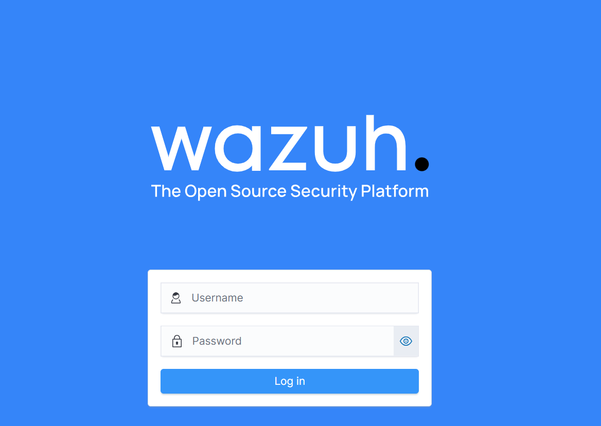
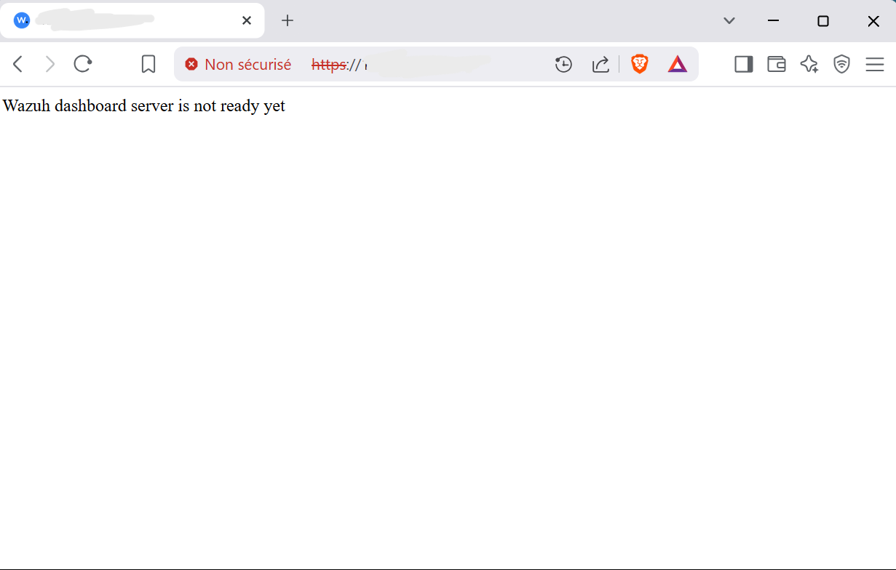
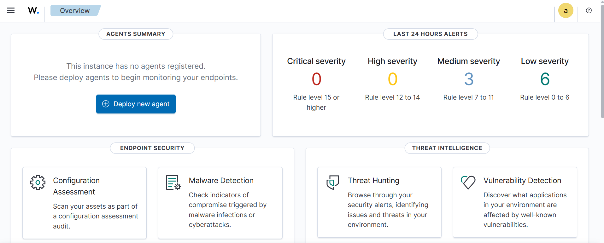
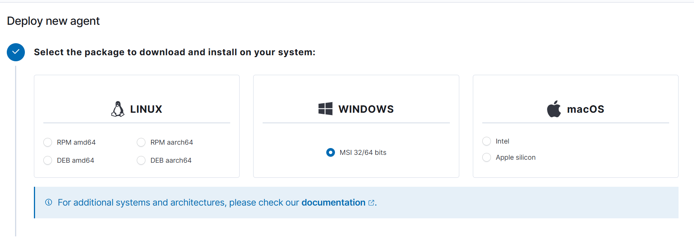

Wazuh Setup and Configuration

1 What is SIEM

SIEM (Security Information and Event Management)  is a cybersecu- rity solution that collects, aggregates, and analyzes large volumes of data from applications, servers, network devices, and users. This data typically includes log files, alerts, and metadata. SIEM plays a crucial role within a  SOC (Security Operations Center) by enabling:

•  Real-time monitoring of network and system activities.

•  Collection and interpretation of data from various sources across an orga- nization.

•  Detection of security threats and triggering alerts.

Among the various SIEM solutions available on the market, we are focusing on Wazuh as our chosen platform.

2 Overview of Wazuh SIEM

Wazuh is an open-source SIEM solution that offers:

•  Threat detection

•  Integrity monitoring

•  Incident response

•  Compliance reporting

While there are many SIEM products available (e.g., Splunk, QRadar, Arc- Sight), Wazuh is highlighted here due to its open-source nature and ease of de- ployment. These qualities make it an attractive choice for organizations seeking a cost-effective and customizable solution to enhance their security operations.

3 Wazuh Architecture

The  Wazuh architecture  consists of several integrated components designed for efficient security monitoring and analysis. At the core are  Wazuh agents , lightweight programs installed on monitored devices that collect security data and send it to a central  Wazuh server . These agents support a wide range of operating systems, including Linux, Windows, macOS. The Wazuh server receives this data, decodes and analyzes it using prede- fined rules, and generates alerts accordingly. These alerts are then forwarded to the  Wazuh indexer , a scalable search and analytics engine (based on Elastic- search or OpenSearch) that indexes and stores the information for fast querying and visualization.

The system is complemented by the  Wazuh Dashboard , a web-based in- terface built on Kibana that provides visual insights, real-time monitoring, com- pliance tracking, and investigative tools, making it easier for analysts to detect, respond to, and manage security incidents.

4 Wazuh Installation

Wazuh provides an  .ova  file that simplifies deployment using virtualization software. You can download the file from the official Wazuh documentation page:

•  https://documentation.wazuh.com/current/deployment-options/virtual-machine/ virtual-machine.html

5 Configuration

•  Network Mode : NAT (Network Address Translation)

•  Host Platform : VMware

•  Target Agent OS : Windows

Step 1: Import the OVA File into VMware

1. Open VMware Workstation or Player.

2. Import the downloaded  .ova  file.

3. Start the virtual machine.

Step 2: Access the Virtual Machine

1. Log in with the default username and password:

Username: admin Password: admin

2. Open a terminal and run either of the following command to get the IP address:

3. In your browser’s URL bar, enter:

https://<IP_ADDRESS>

4. The Wazuh login page should open.

Wazuh Dashboard Interface

Figure 1: Wazuh Dashboard interface after successful login

Step 3: Troubleshooting and Services

Figure 2: Wazuh Dashboard error: Server not ready

Dashboard Server Not Ready

1. Gain Root Privileges

2. Check and Start Wazuh Services

systemctl status wazuh-manager

Start it if inactive:

systemctl start wazuh-manager

systemctl status wazuh-dashboard

Start it if inactive:

systemctl start wazuh-dashboard

systemctl status wazuh-indexer

Start it if inactive:

systemctl start wazuh-indexer

Step 4: Access the Dashboard

After confirming all services are running, refresh your browser. You should now be able to access the Wazuh Dashboard.

Figure 3: Main Wazuh Dashboard view

6 Wazuh Agent Installation and Configuration

6.1 What is the Wazuh Agent?

The Wazuh Agent is a lightweight application installed on endpoints such as Windows, Linux, or macOS systems. Its role is to collect security event data

and forward it to the Wazuh Manager for processing and analysis. Each agent in- cludes multiple modules such as Log Collection, File Integrity Monitoring (FIM), Security Configuration Assessment (SCA), and Malware Detection, which help identify potential threats and policy violations.

6.2 Supported Platforms

6.3 Deploying a New Agent from the Wazuh Dashboard

Step 1: Download the Windows Agent Installer

•  Visit the official Wazuh download page:  https://documentation.wazuh. com/current/installation-guide/wazuh-agent/wazuh-agent-package-windows. html

•  Download the Windows  .msi  installer for the Wazuh agent.

•  Run the installer to begin the installation process.

Step 2: Configure Agent Settings

To begin agent installation, access the Wazuh Dashboard:

•  Navigate to the  Endpoints  tab.

•  Click on  Deploy new agent .

Figure 4: Selecting the Windows agent package

•  Enter the  Server Address  — the IP address of your Wazuh Manager.

•  Specify a  unique Agent Name  (e.g.,  PC1 ).

Figure 5: Enter Wazuh Manager IP address and agent name

Step 3: Register the Agent via PowerShell

After configuration, Wazuh will generate registration commands. These com- mands must be executed in PowerShell to link the agent with the manager.

•  Open  Windows PowerShell  as Administrator.

•  Paste and execute the provided commands.

Figure 6: Agent registration — PowerShell (Part 1)

Figure 7: Agent registration — PowerShell (Part 2)

Step 4: Verify Agent Connection

Once the registration is successful, return to the Wazuh Dashboard.

•  Go to the  Agents  section.

•  Look for the newly added agent in the list.

•  Ensure its status is  Active .

Figure 8: Agent successfully installed and connected

•  Once installed, the agent uses a GUI for configuration, opening the log file, and starting or stopping the service.

•  By default, all agent files are stored in  C: \ Program Files (x86) \ ossec-agent after the installation.

7 Conclusion

This guide provided a step-by-step walkthrough of setting up Wazuh, an open- source SIEM solution, within a virtualized environment. From importing the official OVA into VMware to accessing the Wazuh Dashboard and deploying a Windows agent, each phase was designed to help users build a foundational understanding of how Wazuh operates.

